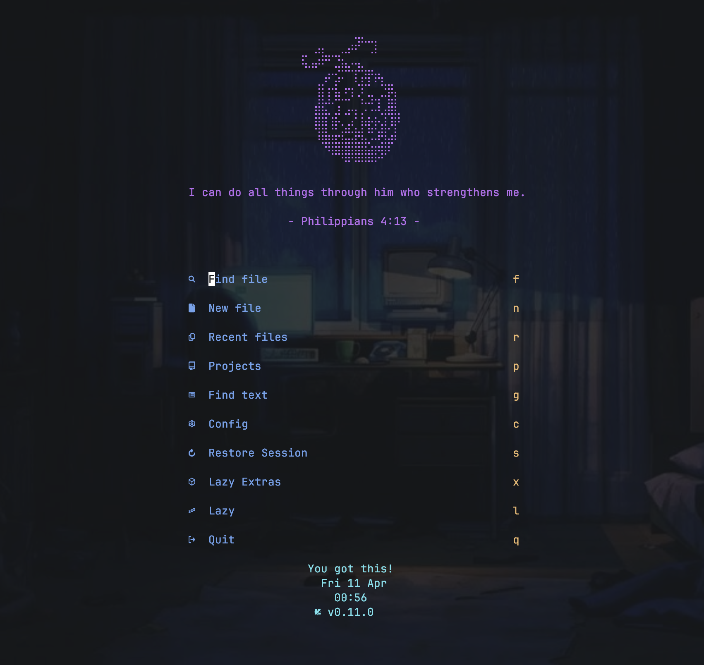

# daily-bible.nvim



Neovim plugin that displays a daily bible verse.

## Installation

### Lazy.nvim

```lua
{
  "AidanAlr/daily-bible.nvim",
  config = function()
    require("dailybible").setup({})
  end,
},
```

### Packer

```lua
use {
  "AidanAlr/daily-bible.nvim",
  config = function()
    require("dailybible").setup({})
  end,
}
```

## Configuration

```lua
{
  -- 'daily' or 'random'
  mode = "daily",

  -- Override the default verses
  verses = {
    {
      verse = "Philippians 4:13",
      text = "I can do all things through him who strengthens me." },
    {
      verse = "Romans 15:13",
      text = "May the God of hope fill you with all joy and peace as you trust in him, so that you may overflow with hope by the power of the Holy Spirit.",
    },
  }
}
```

## Usage

To view today's verse in a new buffer, call

```lua
require('dailybible').show_verse()
```

To run in command mode, use

```vim
lua require('dailybible').show_verse()
```

daily-bible.nvim is compatible with your favorite dashboard plugin.
Configuring with[alpha-nvim](https://github.com/goolord/alpha-nvim) as seen in the example screenshot can be done via the following:

```lua
return {
  "goolord/alpha-nvim",
  event = "VimEnter",
  dependencies = { "RchrdAriza/nvim-web-devicons", "echasnovski/mini.icons", "AidanAlr/daily-bible.nvim" },
  config = function()
    local alpha = require("alpha")
    local dashboard = require("alpha.themes.dashboard")
    local dailybible = require("dailybible")

    -- ASCII image in header
    local header_image_lines = {
      [[⠀⠀⠀⠀⠀⠀⠀⠀⣀⡀⠀⠀⠀⠀⠀⠀]],
      [[  ⣠⡄⠀⠀⣀⡴⠞⠉⢉⡇⠀⠀⠀⠀]],
      [[⢯⣠⡴⠟⠋⣙⣦⡠⢤⡀⠀⠀⠀⠀⠀⠀]],
      [[⠀⠀⠀⢠⠖⣪⠍⠉⡏⡽⡟⡶⡄⠀⠀⠀]],
      [[⠀⠀⢸⡇⡖⣧⠰⢲⢈⠏⣁⠀⣙⡿⡄⠀]],
      [[⠀⠀⣼⣗⠓⢩⠉⣁⡀⢓⢚⣹⢀⣿⡇⠀]],
      [[⠀⠀⣿⣿⢱⡯⡈⣡⠃⣧⡦⡦⣹⢹⡿⠀]],
      [[⠀⠀⢹⣿⣬⡥⣞⣓⡷⣇⢛⣱⢿⣡⡇⠀]],
      [[⠀⠀⠀⠙⢿⣿⣿⣿⣿⣿⣵⡶⣿⠏⠀⠀]],
      [[⠀⠀⠀⠀⠀⠀⠙⠋⠛⠛⠛⠋⠁⠀⠀⠀]],
    }

    -- Create empty header table
    header = {}

    -- Function to center image lines
    local function centerHeaderLine(text, width)
      local text_width = vim.fn.strdisplaywidth(text)
      local padding = math.floor((width - text_width) / 2)
      return string.rep(" ", padding) .. text
    end

    -- Center each line of the ASCII art with the same width (52) used for the verse
    for _, line in ipairs(header_image_lines) do
      table.insert(header, centerHeaderLine(line, 52))
    end

    -- Add the Bible verse
    local verse = dailybible.get_verse()
    local centered_verse = dailybible.center_text(verse.text, verse.verse, 52, 8, 52)
    for _, line_text in pairs(centered_verse) do
      table.insert(header, line_text)
    end

    -- Set the header
    dashboard.section.header.val = header

    -- Send config to alpha
    alpha.setup(dashboard.opts)

    -- Disable folding on alpha buffer
    vim.cmd([[autocmd FileType alpha setlocal nofoldenable]])
  end,
}
```

## Credits to the following plugins

- [inspire](https://github.com/RileyGabrielson/inspire.nvim)
- [alpha-nvim](https://github.com/goolord/alpha-nvim)
